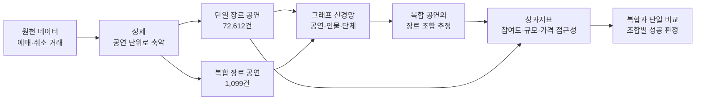

# KOPIS — 복합 장르 공연 콘텐츠의 수익성과 확장 가능성 분석

제5회 KOPIS 빅데이터 공모전 데이터분석 부문 혁신상 (1등) 수상작의 자료와, 1년 뒤에 다시 확인한 기록이다.

공연예술통합전산망은 복합 장르 공연을 한 항목으로만 기록한다. 어떤 장르의 조합인지 알 수 없어 성과를 비교할 수 없다. 이 프로젝트는 복합 공연을 장르 둘의 조합으로 풀고, 자체 성과지표로 단일 장르와 비교했다.

## 분석 흐름



## 폴더

| 폴더 | 내용 | 시기 |
|---|---|---|
| `docs/` | 제안서, 결과보고서, 발표 자료 | 2025 |
| `data/processed/` | 가공한 공연 목록과 성과 지표 입력 | 2025 |
| `data/experiments/` | 채택하지 않은 그래프 실험의 데이터 | 2025 |
| `notebooks/01_genre_classification/` | 복합 장르 분류 모델 세 판 | 2025 |
| `notebooks/02_dpi_indicator/` | 성과지표 산출과 비교 | 2025 |
| `notebooks/03_analysis/` | 탐색, 성공 판정 시각화, 회귀 모델 | 2025 |
| `notebooks/90_experiments/` | 채택하지 않은 그래프 실험 | 2025 |
| `results/` | 예측 결과, 지표 점수, 도표 | 2025 |
| `src/` | 보고서의 절 순서대로 정리한 코드 | 2026 |
| `outputs/` | 정리한 코드가 만든 결과와 점검표 | 2026 |
| `docs/REPORT_CODE_MAP.md` | [보고서와 코드의 대응표](docs/REPORT_CODE_MAP.md) | 2026 |
| `review/` | [재검토 보고서](review/README.md) | 2026 |
| `schema/` | [관계형 데이터 모델](schema/README.md) | 2026 |

2025년 자료는 내용을 고치지 않고 폴더만 정리했다. 노트북은 확장자를 붙이고 실행 기록의 계정 정보를 지웠다.

## 정리한 코드

2025년의 노트북은 실행 순서와 입력 파일이 뒤섞여 있었고, 보고서에 있는 단계 중 코드가 남지 않은 것도 있었다. 보고서의 절 순서대로 다시 정리했다.

| 보고서 절 | 코드 |
|---|---|
| ① 복합·비복합 분류 | `src/step1_split.py` |
| ② 컬럼 선택과 결측 | `src/step2_missing.py` |
| ③ 동명이인 처리 | `src/step3_person_genre.py` |
| ④ GNN 기반 복합 장르 세분화 | `src/step4_genre_gcn.py` |
| ⑤ 성과지표 D-PI | `src/step5_dpi.py` |
| ⑥ 판정 | `src/step6_compare.py` |
| ⑥ 원인과 개선 | `src/step7_improve.py` |

각 단계는 계산한 값을 보고서와 2025년 저장 결과에 견준다. 점검 89건 중 66건이 같다. 2025년 저장 결과와는 24건 모두 같다. 다른 곳과 그 이유는 [대응표](docs/REPORT_CODE_MAP.md) 에 있다.

## 팀과 담당

4인 팀 작업이다.

| 담당 | 내용 |
|---|---|
| 김수진 | 복합 장르 분류 모델 설계와 구현, 동명이인 처리 기준, 발표, 발표 자료 제작 |
| 팀원 | 성과지표 설계와 산출, 복합과 단일 비교 |
| 팀원 | 성공 판정 시각화, 회귀 모델, 그래프 실험 |

2026년 재검토와 관계형 모델 재설계는 김수진이 AI 코딩 도구와 함께 했다.

## 재검토에서 확인한 것

| 확인한 것 | 결과 |
|---|---|
| 분류 모델 성능 | 보고한 0.99는 학습 데이터로 잰 값이다. 검증을 나누면 정확도 0.84, 단순 기준선은 0.77이다 |
| 복합과 단일의 평균 | 보고서의 51.98 대 45.06 은 유료 복합만 다른 공식으로 계산한 값이다. 공식을 맞추면 46.78 대 45.06 이다 |
| 성공률 | 보고서의 37.7%, 40.4% 는 저장한 비교표의 실패 비율이다. 공식을 맞추면 유료 37.7%, 무료 59.6% 다 |
| 복합과 단일의 우열 | 무료 공연에서만 복합이 높다 |
| 성과지표 | 보고서의 접근성 가산점은 최종 점수에 들어가지 않았다. 유료 가중치도 보고서와 다르다 |
| 재현성 | 다시 학습하면 장르 조합이 40%만 같다 |

자세한 내용은 [대응표](docs/REPORT_CODE_MAP.md) 와 [재검토 보고서](review/README.md) 에 있다.

## 실행

```bash
pip install -r requirements.txt

# 정리한 코드
python src/run_all.py            # 분류 모델을 빼고 실행
python src/run_all.py --model    # 분류 모델까지 실행

# 관계형 모델
python schema/01_profile_raw.py
python schema/02_check_keys.py
python schema/03_build.py
python schema/04_queries.py
```

`Dockerfile` 은 같은 환경을 컨테이너로 만든다. 로컬 설치가 어려울 때 쓴다.

## 데이터

원천 데이터 `data/raw/temp.csv` 는 586MB 라 저장소에 없다. 공모전 주최 측이 참가자에게 제공한 자료다.
