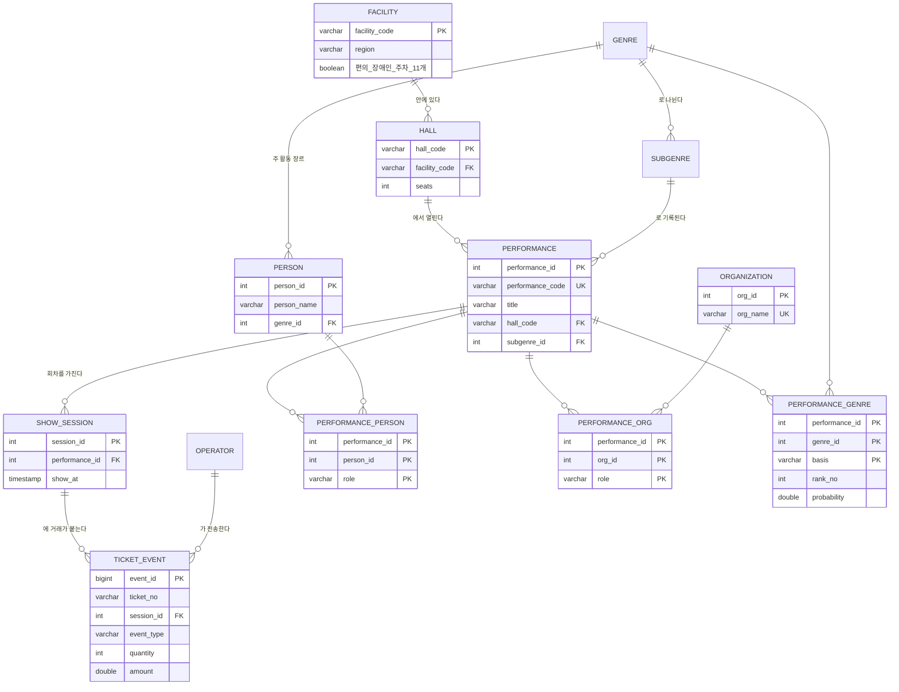

# 관계형 데이터 모델

공모전 당시에는 71열짜리 원천 파일에서 필요한 열만 뽑아 CSV 로 가공했다. 2026년 9월에 그 데이터를 관계형 모델로 다시 설계했다. 이 문서는 무엇을 어떻게 나눴고 왜 그렇게 나눴는지 적는다.

모든 수치는 `01_profile_raw.py`, `02_check_keys.py`, `03_build.py`, `04_queries.py` 를 실행해 얻은 값이다.

## 출발점

원천 파일 한 행은 입장권 한 장의 예매 또는 취소다. 그 한 행에 시설, 공연장, 공연, 회차 정보가 전부 반복된다.

| 항목 | 값 |
|---|---|
| 행 | 676,444 |
| 열 | 71 |
| 공연시설 | 213 |
| 공연장 | 250 |
| 공연 | 329 |
| 회차 | 1,992 |
| 입장권 | 486,854 |

이 파일은 전체 데이터의 일부다. 공연 목록 CSV 에는 공연이 75,933건 있다.

## 엔터티와 관계



| 테이블 | 행 | 한 행이 뜻하는 것 |
|---|---|---|
| `facility` | 213 | 공연시설 하나 |
| `hall` | 250 | 시설 안의 공연장 하나 |
| `genre` | 9 | 장르 (중분류) |
| `subgenre` | 25 | 세부장르 |
| `performance` | 76,262 | 공연 하나 |
| `performance_genre` | 78,460 | 공연과 장르의 연결 하나 |
| `person` | 66,956 | 인물 하나 (이름과 주 장르의 조합) |
| `organization` | 13,016 | 기획·제작 단체 하나 |
| `performance_person` | 283,503 | 어떤 인물이 어떤 공연에 어떤 역할로 참여 |
| `performance_org` | 157,417 | 어떤 단체가 어떤 공연에 어떤 역할로 참여 |
| `show_session` | 1,992 | 회차 하나 |
| `ticket_event` | 676,444 | 예매 또는 취소 한 건 |

그 밖에 예매처 `operator`, 예매 방식 `booking_channel`, 결제 수단 `payment_method`, 할인 종류 `discount_type` 코드 테이블이 있다.

## 관계를 정한 근거

| 관계 | 종류 | 확인한 사실 |
|---|---|---|
| 시설과 공연장 | 1 : N | 공연장 250곳이 모두 시설 한 곳에만 속한다. 시설 27곳은 공연장이 둘 이상이다 |
| 공연장과 공연 | 1 : N | 공연 329건이 모두 공연장 한 곳만 쓴다 |
| 공연과 회차 | 1 : N | 공연 하나에 회차가 1개에서 수십 개 |
| 회차와 거래 | 1 : N | 거래는 회차 하나에 붙는다 |
| 공연과 인물 | N : M | 한 공연의 출연진 칸에 최대 7명. 한 인물이 여러 공연에 나온다 |
| 공연과 단체 | N : M | 한 공연의 기획제작사 칸에 최대 8곳 |
| 공연과 장르 | N : M | 복합 공연은 장르 둘의 조합이다 |
| 장르와 세부장르 | 1 : N | 세부장르 이름 둘(기악, 성악)이 두 장르에 함께 있다 |

## 설계하면서 고민한 곳

### 1. 공연명은 키가 될 수 없다

공연 목록 75,933건 중 이름이 겹치는 행이 6,204건이다. 순회 공연과 재공연이 같은 이름을 쓴다. 원천에는 공연코드가 있지만 가공한 목록 파일에는 코드가 빠져 있다. 그래서 대리키 `performance_id` 를 만들고 공연코드는 있을 때만 채우는 유일 열로 두었다.

공모전 당시 분류 모델은 행 번호를 공연의 식별자로 썼다. 파일의 행 순서가 바뀌면 예측 결과와 공연의 짝이 어긋나는 구조였다.

### 2. 인물은 고유 식별자가 없다

이름 43,610개 중 13,272개가 둘 이상의 장르에 나온다. 이름만 키로 쓰면 동명이인이 한 사람으로 합쳐진다. 가장 흔한 이름들은 8개 장르에 걸쳐 나온다.

보고서에서 정한 대로 (이름, 장르) 를 준식별자로 썼다. 장르는 대분류보다 세밀하고 세부장르보다 덜 세밀한 중분류를 쓴다. 대분류는 동명이인을 가르지 못하고, 세부장르는 한 사람을 여럿으로 쪼갠다.

이 방법에는 한계가 있다. 뮤지컬과 연극을 오가는 한 사람이 두 명으로 기록된다. 고유 식별자 없이는 풀 수 없다.

### 3. 복합 공연 참여자는 준식별자를 만들 수 없다

복합 공연은 장르가 정해지지 않았다. 참여자에게 장르를 붙이면 "복합" 이 되고, 그 사람은 단일 장르 활동 이력과 끊어진다. 분류 모델은 바로 그 연결로 장르를 추정하므로 끊으면 안 된다.

복합 공연 참여자는 같은 이름으로 단일 공연에 가장 많이 참여한 인물에 이었다.

| 복합 공연 참여자 4,046명 | 수 |
|---|---|
| 한 장르에서만 활동 | 915 |
| 여러 장르에 걸쳐 있어 어느 쪽인지 모호 | 2,536 |
| 단일 공연 이력이 없음 | 595 |

모호한 2,536명이 데이터의 한계이면서 복합 장르를 추정할 실마리다.

### 4. 역할은 단체가 아니라 관계의 속성이다

기획제작사 칸은 "단체명(역할)" 형식이다. 역할은 주최, 주관, 제작사, 기획사 네 가지다. 단체 7,387곳이 공연에 따라 역할이 다르다. 역할을 단체 테이블에 두면 한 값만 남는다. 연결 테이블 `performance_org` 의 키에 역할을 넣었다.

인물도 같다. 한 사람이 어떤 공연에서는 출연하고 다른 공연에서는 제작한다.

### 5. 인물과 단체를 한 표에 섞지 않는다

이름이 같은 인물과 단체가 13건 있다. 공모전 당시 코드는 "이름이 제작사 목록에 있으면 제작사" 로 판정해, 같은 공연에서 이름이 겹치면 인물이 제작사로 바뀌었다. 테이블을 나누면 이 문제가 생기지 않는다.

### 6. 거래의 키

입장권번호는 유일하지 않다. 예매와 취소가 같은 번호를 쓴다. 입장권 188,914장이 예매와 취소를 모두 가진다. (입장권번호, 구분) 조합도 676건이 겹쳤다. 대리키 `event_id` 를 두었다.

예매와 취소를 한 테이블에 구분 값으로 둔 이유는 판매 좌석을 "예매 합에서 취소 합을 뺀 값" 으로 계산하기 때문이다.

### 7. 회차 번호를 믿을 수 없다

원천의 공연회차 열은 모든 행이 1이다. 회차는 (공연, 공연일시) 조합으로 식별했다.

### 8. 추정값과 기록값을 섞지 않는다

`performance_genre` 의 `basis` 는 전산망 기록이면 `label`, 모델 추정이면 `predicted` 다. 추정에는 순위와 확률을 함께 둔다. 복합 공연 1,099건 중 둘째 장르의 확률이 0.1 이상인 것은 518건이다. 확률을 버리면 근거가 약한 조합과 강한 조합을 구분할 수 없다.

## 나눈 결과의 검증

| 확인 | 결과 |
|---|---|
| 거래 행 수 | 원천 676,444 = 나눈 뒤 676,444 |
| 거래 금액 합 | 원천과 일치 |
| 순매출 합 (예매에서 취소를 뺌) | 공연 단위 집계와 원천 직접 계산이 일치 |
| 복합 공연 추정 연결 | 1,099건 모두 공연명까지 일치 |
| 저장하는 칸 수 | 원천의 21.2% |

## 이 모델로 할 수 있는 것

- `v_performance_metrics` 는 거래에서 공연 단위 지표를 집계한다. 회차 수, 판매 좌석, 순매출, 좌석점유율, 평균 단가, 접근성 점수다. 성과지표의 입력이 된다.
- `v_graph_edge` 는 관계 테이블에서 그래프의 엣지를 뽑는다. 분류 모델의 입력이 된다.

좌석점유율이 1 을 넘는 공연이 19건 나온다. 좌석 수보다 많이 팔린 기록이다. 공모전 당시 판매 좌석을 보정한 이유가 이것이다.

## 실행

```bash
python schema/01_profile_raw.py    # 원천 적재와 열 구조 파악
python schema/02_check_keys.py     # 키 후보 검증
python schema/03_build.py          # 테이블 생성, 적재, 검증
python schema/04_queries.py        # 분석 질의
```

`data/raw/temp.csv` 가 있어야 한다. 586MB 라 저장소에는 없다.
